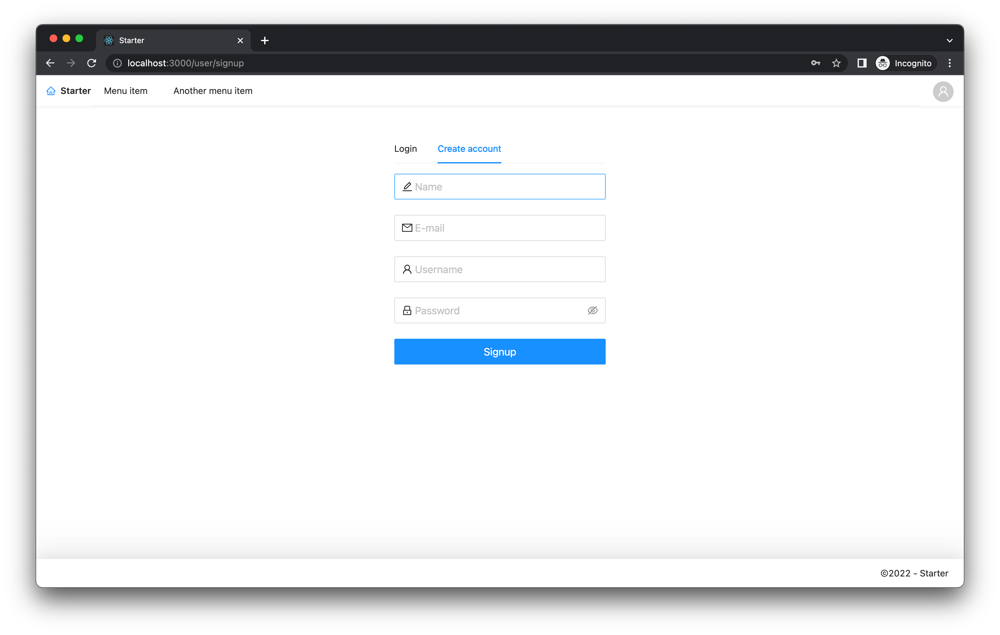
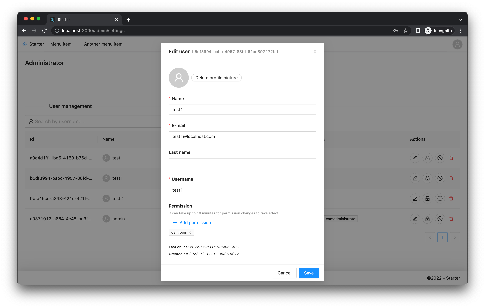

# project-starter

This repository contains code to quickly start a new React+GraphQL project with authentication/authorization features built in. It has the following (end-user facing) features:

* Simple and clear layout
* Translations (i18n)
* Account creation
* Account activation through email
* Password reset through email
* User can change their profile (picture)
* Admin has access to a fully fledged Admin panel in which he can manage all users
* Admin has access to some simple statistics about the usage of the site
* Responsive design (mobile and desktop)

To get a better visual picture of what this all means see screenshots below.

This codebase is a very opinionated Node.js v16 monorepo using npm workspaces, TypeScript, React + router, GraphQL (Apollo) + codegen, AntDesign, Express, TypeORM (postgres), ESLint + prettier, GitHub Actions for CI and AWS S3 for storage solutions. If you have a basic grasp of these technologies then this codebase should be easily extendable for you.

Documentation is scarces for this project. Try understanding this README completely and study the npm scripts in the `package.json` files and you should come a long way.

## Screenshots

### Home
_Mouse is hovering over the user menu icon top right._


### Create account


### User settings


### Administrator and menu
_Mouse is hovering over the user menu icon top right._


### Administrator manage user


## Development setup

### Dependencies

`npm i` in the root and let npm workspaces install everything everywhere.

### Un/installing a dependency

Install: `npm i aws-sdk -w server`  
Uninstall: `npm uninstall aws-sdk -w server`

This most likely throws an error, something along the lines of "cannot set 'dev' on null". This is an npm bug, everything should just work and be un/installed.

#### server setup

Follow these steps to setup and develop the server:
1) Install docker and pull in a postgres image.
2) Run a postgres container (execute `npm run postgres:start` in root)
3) Copy `.env.default` to `.env` and set values to your liking
4) Create database named 'test' (or w/e you called it in your .env file)
5) Run migration to setup database and seed it (see below for more elaboration on migrations)
6) Optionally set `synchronize` to true in the `.env` file to develop quicker

After, you can start server with:

```
$ npm run start -w server
```

The `-w server` is optional. You can also just start the product with the start script directly in the server directory.

#### s3 bucket setup

Create a new S3 bucket and set **Block all public access** to _off_. Set Object Ownership to **Bucket owner preferred**. Set the bucket policy to something similar to:

_Note: I used `bucket-user` and `bucketname` as examples._

```json
{
    "Version": "2012-10-17",
    "Id": "Policy1574855570149",
    "Statement": [
        {
            "Sid": "Stmt1574855564698",
            "Effect": "Allow",
            "Principal": {
                "AWS": "arn:aws:iam::123456789123:user/bucket-user"
            },
            "Action": [
                "s3:DeleteObject",
                "s3:PutObject",
                "s3:PutObjectAcl"
            ],
            "Resource": "arn:aws:s3:::bucketname/*"
        }
    ]
}
```

Next allow CORS:

_Note: set allowed origins to your origins only._

```json
[
    {
        "AllowedHeaders": [
            "*"
        ],
        "AllowedMethods": [
            "PUT",
            "POST",
            "DELETE",
            "GET"
        ],
        "AllowedOrigins": [
            "*"
        ],
        "ExposeHeaders": []
    }
]
```

Lastly, generate an **Access key** for `bucket-user` and copy key and secret into the .env file inside the server directory. Don't forget to set all other AWS properties as well.


#### client setup

Before developing the client you should build the shared module. The current babel config for react-scripts does not have loaders for externally included typescript (outside of /src). So, to include the shared module you first have to build it and then include the js.

In the root of the project run:

```
$ npm run build -w shared
```

Remember that if you make changes to the shared lib that you have to rebuild the shared library in order for you to import it in the client.

After, you can start client with:

```
$ npm run start -w client
```

The `-w client` is optional. You can also just start the product with the start script directly in the client directory.

#### Migrations

To create a new blank migration run `migration:create`. To generate a migration based on changes made to the model run `migration:generate`.

To revert the latest migration run `migration:revert`.

To execute all the migrations run `migration:run`.

```
$ npm run migration:create -name=MigrationName
$ npm run migration:generate -name=MigrationName
$ npm run migration:run
$ npm run migration:revert
```

## Build & Deploy

Build and deploy are quite peculiar. Study the next text well.

### Build

To build the whole repository at once execute `npm run build` in the root directory. Before running the build command for each workspace `npm i` is invoked in order to install new dependencies that might have been installed during development.

This will output compiled code in `build` folders in all workspaces. You will find the following directories: `./client/build`, `./server/build` and `./shared/build`.

The ones who are paying attention will notice that the `npm run build` also generates and copies over self-signed certificates to the build directory. If this is unwanted behaviour change it yourself. The server will try to read out the certificate using a very specific filename, you can find these variables in the `./server/index.ts` file.

### Deploy

The deploy is quite opionated. The server expect the built client to be found at `../../client/build` (relative to `./server/build`). From here the express server will be serving static content (the frontend). That means that all the `build` folders should be deployed on the same machine with the same directory structure as found in this repository.

In production the server expects to be ran and managed by `pm2`. See the `npm run start:production` command. Note that `authbind` is used in case you're planning to use port 80 directly. Make sure `authbind` alongside with `pm2` is installed on your production machine.

In production mode the server will have https redirect enabled. Because of it you will need to supply certificates yourself or generate self-signed certificates using `npm run certificate:generate`. This will generate a self-signed certificate based on `req.conf` in the scripts directory. The certificate pem files need to go in the server root directory, with a specific name. The key must go here: `./server/build/key.pem` and the certificate must go here: `./server/build/certificate.pem`.

To finalize the deploy; copy the following files and folder to your production machine and you will be up and running:

* `./node_modules`
* `./shared/build`
* `./server/node_modules`
* `./server/build`
* `./client/build`

You might need to copy one or more files over to complete the deploy. For example you can have a production version of the `.env` file. Copy this file into the `./server/build` folder. To run the server you have two options. Either install `npm` on your prod machine and copy over the `./server/package.json` file then run `npm run start:production`. Or, you could setup an own script that executes the equivalent of the `npm run start:production` command and _not_ install `npm`.